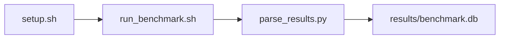

# SGLang Prompt-Response Benchmark Benchmark

[](LICENSE)
[](.github/workflows/ci.yml)

Target: Ubuntu 26.04 · AMD · see Hardware Requirements. This is a host benchmark, not a laptop `pip install` project.

## Quick Start

```bash
git clone https://github.com/garys-gpu-benchmarks/330-gpu-bench-amd-sglang-prompt-response-ubu2604.git
cd 330-gpu-bench-amd-sglang-prompt-response-ubu2604
sudo bash setup.sh --assume-yes
bash run_benchmark.sh --profile smoke --validate
```
Results are written to `results/benchmark.db` and `results/summary.json`.

This workload is executed on the validation host after the repository is copied there. `setup.sh` and `run_benchmark.sh` do not open an outbound SSH session.

Prerequisites: Ubuntu 26.04; AMD; Python 3.14.4; root or sudo for `setup.sh`. Framework: Bash, SQLite, Python, PyYAML, ROCm Runtime, PyTorch-ROCm, Hugging Face Transformers, SGLang, Mistral-7B-v0.3, aiter. Set HF_TOKEN when the model license requires a Hugging Face token. This is a host benchmark, not a laptop `pip install` project.



## 1. Overview

Starts tiny_sglang_server.py on smoke, or python -m sglang.launch_server with Mistral-7B-v0.3 --dtype bfloat16 on baseline/extended (port 30000, aiter enabled). Then runs scripts/prompt_response_client.py sequentially. Do not use bench_serving.py. output_format: csv Sweep dimensions: dtype, input_len, output_len, num_prompts, seed, streaming.

## 2. What It Validates

- Validates sequential one-request-at-a-time prompt responses, including latency, token rate, and cache-hit reporting. This is not concurrent serving. Smoke uses scripts/tiny_sglang_server.py; baseline and extended use sglang.launch_server
- #1: E2E latency, ms (end_to_end_latency_ms); is present and physically sensible.
- #2: Time To First Token (ttft_ms); is present and physically sensible.
- #3: Output token generation rate (decode), tokens/s (output_tokens_per_s); is present and physically sensible.
- #4: RadixAttn hit rate, pct (radixattention_cache_hit_rate_pct); is present and physically sensible.
- #5: Completed request rate, pct (completed_request_rate_pct) is present and physically sensible.

## 3. Metrics Captured

- **#1: E2E latency, ms** — stored as `end_to_end_latency_ms`.
- **#2: Time To First Token** — stored as `ttft_ms`.
- **#3: Output token generation rate** — stored as `decode`.
- **#4: RadixAttn hit rate, pct** — stored as `radixattention_cache_hit_rate_pct`.
- **#5: Completed request rate, pct** — stored as `completed_request_rate_pct`.

## 4. Hardware Requirements

### Supported environment

- OS: Ubuntu 26.04
- GPU vendor: AMD
- Framework family: Bash, SQLite, Python, PyYAML, ROCm Runtime, PyTorch-ROCm, Hugging Face Transformers, SGLang, Mistral-7B-v0.3, aiter
- Python: Python 3.14.4

### Reference validation environment

The tables below describe the machine used to generate the reference results. They are not a requirement that every user buy that exact cloud instance.

### System

Ubuntu 26.04 / AMD / Bash, SQLite, Python, PyYAML, ROCm Runtime, PyTorch-ROCm, Hugging Face Transformers, SGLang, Mistral-7B-v0.3, aiter

### GPU

Ubuntu 26.04 / AMD / Bash, SQLite, Python, PyYAML, ROCm Runtime, PyTorch-ROCm, Hugging Face Transformers, SGLang, Mistral-7B-v0.3, aiter

## 5. Software Requirements

| Component | Version |
|---|---|
| OS | Ubuntu 26.04 |
| Kernel | kernel 7.0.0 |
| Python | Python 3.14.4 |
| ROCm | ROCm 7.14 |
| rocBLAS | rocBLAS 5.2.0 |

Starts tiny_sglang_server.py on smoke, or python -m sglang.launch_server with Mistral-7B-v0.3 --dtype bfloat16 on baseline/extended (port 30000, aiter enabled). Then runs scripts/prompt_response_client.py sequentially. Do not use bench_serving.py.

## 6. Installation

```bash
Smoke starts scripts/tiny_sglang_server.py; baseline and extended start python -m sglang.launch_server, then scripts/prompt_response_client.py
```

## 7. Running the Benchmark

```bash
Smoke starts scripts/tiny_sglang_server.py; baseline and extended start python -m sglang.launch_server, then scripts/prompt_response_client.py
```

**Validating results separately:**

```bash
export BENCHMARK_PYTHON=/usr/bin/python3.13  # optional
python3 -m venv .venv
source ".venv/bin/activate"
".venv/bin/python" scripts/validate_results.py
```

## 8. Output

### `results/benchmark.db` (SQLite)

CSV with one row per prompt, plus a printed summary line

request_id,sample_index,status,input_tokens,output_tokens,end_to_end_latency_ms,ttft_ms,output_tokens_per_s,completed_request_rate_pct,radixattention_cache_hit_rate_pct,prompt_tokens,cached_tokens,error_message
0,0,ok,128,32,400,40,80,100,0,128,0,

```bash
Smoke starts scripts/tiny_sglang_server.py; baseline and extended start python -m sglang.launch_server, then scripts/prompt_response_client.py
```

### `results/summary.json`

Consolidated metrics from the most recent run — suitable for CI artifact upload or dashboard ingestion.

### `results/raw/<timestamp>.txt`

CSV with one row per prompt, plus a printed summary line

request_id,sample_index,status,input_tokens,output_tokens,end_to_end_latency_ms,ttft_ms,output_tokens_per_s,completed_request_rate_pct,radixattention_cache_hit_rate_pct,prompt_tokens,cached_tokens,error_message
0,0,ok,128,32,400,40,80,100,0,128,0,

## 9. Baselines / Thresholds

Expected ranges and gates live in `config/benchmark_config.yaml` under `baselines:` or `thresholds:`. To update them, edit that file — never edit validation code directly.

## 10. Troubleshooting

**`setup.sh` missing collector**
Create cannot finish without `scripts/collect_workload.py`.

**`self_check` overlay rewritten**
Do not overwrite files listed in `results/overlay_lock.json`.

**Remote SSH drop during setup**
Reconnect and resume `bash setup.sh --assume-yes`. Do not wipe `.venv` or `.cache`.

## 11. NVIDIA H100 Coding Differences

Primary target is AMD ROCm. NVIDIA notes in this section are reference only and are not the execution path.

## Repository layout

```text
.
├── setup.sh
├── run_benchmark.sh
├── benchmark_specification.json
├── config/
├── scripts/
├── src/
├── tests/
├── docs/
├── results/
└── LICENSE
```
